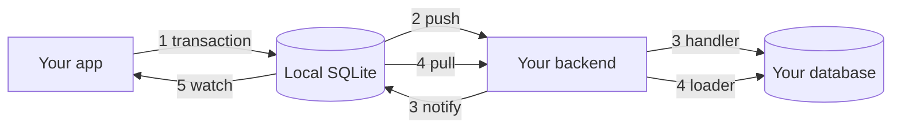

# Ahead

Local-first state for TypeScript and Dart. Write your API as handlers. Call it like a local function. It works offline, and the client is always one step ahead of the server.

Ahead is a library, not a service. Mutations settle in your own database transaction, and your app reads from a local SQLite copy that catches up as the server confirms.

## How it works

### 1. Describe your data and your mutations

```
model Todo {
  id    String
  title String
  done  Boolean
  @@id(id)
}

mutation AddTodo      { todo Todo.create }
mutation CompleteTodo { todo Todo.update<done> }
```

The compiler turns this file into a typed client for TypeScript and Dart, and into `Handlers` and `Loaders` types for the backend.

### 2. Read and write on the client

```ts
// Read.
const open = await client.models.todo.query({ where: { done: false } });

// Watch. Updates on every change.
client.models.todo.watch({ where: { done: false } }, (todos) => render(todos));

// Write, inside a transaction.
await client.transaction(async (tx) => {
  await tx.mutate.addTodo({
    todo: { id: "t1", title: "Buy milk", done: false },
  });
  await tx.mutate.completeTodo({
    todo: { identity: { id: "t1" }, values: { done: true } },
  });
});
```

```ts
// Open the local database and connect.
import { GeneratedClient, httpTransport } from "./generated/client.ts";

const client = await GeneratedClient.open({
  path: "local.sqlite",
  transport: httpTransport({
    url: "http://127.0.0.1:4242",
    token: "demo-user",
  }),
});

// Subscribe to the channels you want to sync.
await client.channels.subscribe("todos");
```

The connection sends queued mutations when the network allows, retries on its own, and pulls every record the backend notified about.

### 3. Write the backend

```ts
import {
  createBackend,
  devAuth,
  type Handlers,
  type Loaders,
} from "./generated/backend.ts";

// Implement the handlers from the generated interface, one per mutation.
const handlers: Handlers<Tx> = {
  async addTodo({ input, tx, notify }) {
    await tx.todo.create({ data: input.todo });

    // Notify the subscribed clients to reload these records.
    notify({ channel: "todos", records: [input.todo] });
  },
  async completeTodo({ input, tx, notify }) {
    await tx.todo.update({
      where: input.todo.identity,
      data: input.todo.patch,
    });

    notify({ channel: "todos", records: [input.todo] });
  },
};

// Implement the loaders from the generated interface, one per model.
const loaders: Loaders<Tx> = {
  todo: ({ ids, tx }) =>
    Promise.all(ids.map((identity) => tx.todo.findUnique({ where: identity }))),
};

// Start the server.
const backend = createBackend({
  database: prisma(new PrismaClient()),
  authenticate: devAuth(),
  handlers,
  loaders,
});
await backend.listen({ port: 4242 });
```

## How it fits together



1. Your app writes in a transaction. The change lands in local SQLite, and reads see it at once.
2. The connection pushes the mutation to your backend when the network allows.
3. The handler runs in one database transaction and calls `notify` with the records that changed.
4. Every client subscribed to that channel pulls those records. The backend answers through the loader.
5. Local SQLite updates and `watch` fires again. If the handler rejected the mutation, the local change rolls back instead.

## Try it

You need Rust, Node 22.18+, Python 3 and the PostgreSQL command-line tools.

```sh
bash examples/rust-round-trip/run.sh
```

In another terminal:

```sh
node examples/rust-round-trip/client.mts
```

Type `edit some text`. The entry prints twice: first the local change, then the server's version. Stop the server, edit again, and start it back up to watch the queue settle. See the [example README](examples/rust-round-trip/README.md).

## Status

Ahead is a source alpha with no package release and no license yet. It runs on macOS through Node and Dart.

[Documentation](website/README.md)
