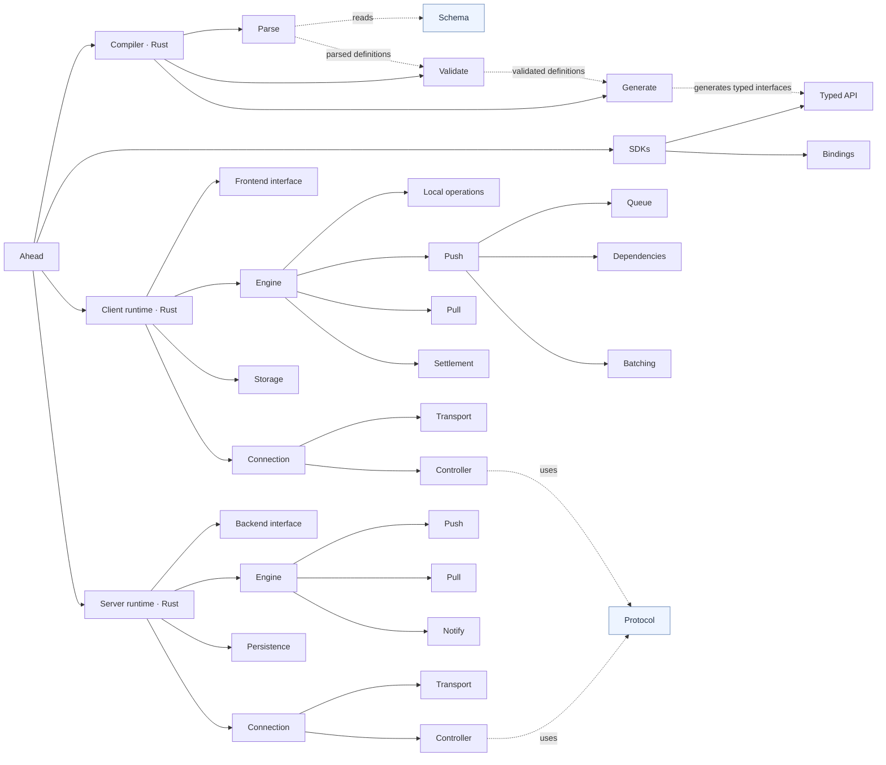

# Architecture

See the [component documentation index](architecture/README.md) for individual design documents.

## Components

- **[Schema](architecture/schema/README.md)** — User-written, language-independent definitions of models, fields, types, identities and mutations.
  - **[Types](architecture/schema/types.md)** — Scalar and enum types, lists and nullability.
  - **[Models](architecture/schema/models.md)** — Fields, identities and unique constraints.
  - **[Relations](architecture/schema/relations.md)** — References, inverse relations and deletion rules.
  - **[Mutations](architecture/schema/mutations.md)** — Operation groups, argument bindings, versions and sequencing.
  - **[Prerequisites](architecture/schema/prerequisites.md)** — Prerequisite declarations and references.
- **[Protocol](architecture/protocol/README.md)** — Language-independent push, pull, receipt, checkpoint and subscription message formats.
  - **[Common](architecture/protocol/common.md)** — Shared fields, counters and encoding conventions.
  - **[Push](architecture/protocol/push.md)** — Mutation batches, receipts, rejections and checkpoints.
  - **[Pull](architecture/protocol/pull.md)** — Requests, record changes, cursors and pagination.
  - **[Subscriptions](architecture/protocol/subscriptions.md)** — WebSocket subscription requests and acknowledgments.
- **[Compiler (Rust)](architecture/compiler/README.md)** — Compile schemas and generate typed interfaces.
  - **[Parse](architecture/compiler/parse.md)** — Convert schema text into structured definitions.
  - **[Validate](architecture/compiler/validate.md)** — Check types, references and mutations in the parsed definitions.
  - **[Generate](architecture/compiler/generate.md)** — Produce runtime descriptors and typed SDK interfaces from validated definitions.
- **[SDKs (TypeScript, Dart, etc.)](architecture/sdks/README.md)** — Convert typed calls to Rust interfaces and results back.
  - **[Typed API](architecture/sdks/typed-api.md)** — Expose strongly typed APIs to applications.
  - **[Bindings](architecture/sdks/bindings.md)** — Bridge calls, arguments, results, errors and events between the language and Rust.
- **[Client runtime (Rust)](architecture/client/README.md)** — Local state, storage and sync.
  - **[Frontend interface](architecture/client/frontend-interface.md)** — Expose reads, writes, subscriptions and status to SDKs.
  - **[Engine](architecture/client/engine/README.md)** — Local reads and writes, mutations, cursors, rollback and settlement.
    - **[Local operations](architecture/client/engine/local-operations.md)** — Local reads, writes and transactions.
    - **[Push](architecture/client/engine/push/README.md)** — Queue mutations, track dependencies and freeze batches.
      - **[Queue](architecture/client/engine/push/queue.md)** — Persist mutations, operations and their ordering.
      - **[Dependencies](architecture/client/engine/push/dependencies.md)** — Decide which mutations are eligible to send.
      - **[Batching](architecture/client/engine/push/batching.md)** — Freeze eligible mutations and preserve their bytes for retries.
    - **[Pull](architecture/client/engine/pull.md)** — Apply server changes and advance cursors.
    - **[Settlement](architecture/client/engine/settlement.md)** — Process decoded receipts and cursors to confirm mutations, roll back rejections and replay pending changes.
  - **[Storage](architecture/client/storage.md)** — Execute Engine-requested SQL and transactions; no sync policy.
  - **[Connection](architecture/client/connection/README.md)** — HTTP/WebSocket, catch-up and reconnect.
    - **[Transport](architecture/client/connection/transport.md)** — Send and receive HTTP/WebSocket messages.
    - **[Controller](architecture/client/connection/controller.md)** — Encode and decode protocol messages; coordinate connection, subscription, catch-up, cancellation, reconnect and authentication refresh.
- **[Server runtime (Rust)](architecture/server/README.md)** — Sync protocol and backend execution.
  - **[Backend interface](architecture/server/backend-interface.md)** — Invoke application handlers and loaders.
  - **[Engine](architecture/server/engine/README.md)** — Process mutations, pulls, receipts and checkpoints.
    - **[Push](architecture/server/engine/push.md)** — Validate and deduplicate mutation batches, invoke handlers and produce receipts.
    - **[Pull](architecture/server/engine/pull.md)** — Find changes by channel cursor and invoke loaders to return records.
    - **[Notify](architecture/server/engine/notify.md)** — Record changed records and channels, and update cursors and stamps.
  - **[Persistence](architecture/server/persistence.md)** — Persist sync metadata within the application's transaction; no business logic.
  - **[Connection](architecture/server/connection/README.md)** — HTTP/WebSocket, subscriptions and streaming.
    - **[Transport](architecture/server/connection/transport.md)** — Send and receive HTTP/WebSocket messages.
    - **[Controller](architecture/server/connection/controller.md)** — Encode and decode protocol messages; manage connections, invoke application-provided authentication, coordinate channel subscriptions and stream changes.

## Component graph

Target architecture. Connection and protocol handling are not yet fully separated from SDKs and Engines in the current code.

Solid lines show composition; dashed lines are labeled with contract use or data flow.

## Code map

Current code locations for the components above. Some responsibilities still share files. Each leaf document records known risks and implementation gaps in its section 11.

| Component | Code location |
|---|---|
| Schema | Source syntax in [compiler/lib.rs](../../crates/compiler/src/lib.rs) |
| Protocol | [core/protocol.rs](../../crates/core/src/protocol.rs); subscription messages in [server/live.rs](../../crates/server/src/live.rs) |
| Compiler / Parse | [compiler/lib.rs](../../crates/compiler/src/lib.rs); file concatenation and error relocation in [compiler/main.rs](../../crates/compiler/src/main.rs) |
| Compiler / Validate | [compiler/lib.rs](../../crates/compiler/src/lib.rs); version history and fence in [compiler/history.rs](../../crates/compiler/src/history.rs) |
| Compiler / Generate | Descriptors emitted by [compiler/lib.rs](../../crates/compiler/src/lib.rs), represented by [core/schema.rs](../../crates/core/src/schema.rs); typed interfaces in [compiler/emit.rs](../../crates/compiler/src/emit.rs); output files in [compiler/main.rs](../../crates/compiler/src/main.rs) |
| SDKs / Typed API | [client-js](../../packages/client-js), [dart](../../packages/dart/lib), [server](../../packages/server); model-specific interfaces are compiler output |
| SDKs / Bindings | [bindings/common](../../bindings/common), [bindings/node](../../bindings/node), [bindings/dart](../../bindings/dart) |
| Client / Frontend interface | [client/lib.rs](../../crates/client/src/lib.rs); per-transaction handle in [client/engine.rs](../../crates/client/src/engine.rs) |
| Client / Engine / Local operations | [client/mutate.rs](../../crates/client/src/mutate.rs), [client/query.rs](../../crates/client/src/query.rs), [client/rows.rs](../../crates/client/src/rows.rs) |
| Client / Engine / Push / Queue | [client/queue.rs](../../crates/client/src/queue.rs), [client/ddl.rs](../../crates/client/src/ddl.rs) |
| Client / Engine / Push / Dependencies | [client/policies.rs](../../crates/client/src/policies.rs), [client/queue.rs](../../crates/client/src/queue.rs); eligibility checks in [client/push.rs](../../crates/client/src/push.rs) |
| Client / Engine / Push / Batching | [client/push.rs](../../crates/client/src/push.rs); push assignment in [client/queue.rs](../../crates/client/src/queue.rs) |
| Client / Engine / Pull | [client/downlink.rs](../../crates/client/src/downlink.rs), [client/ledger.rs](../../crates/client/src/ledger.rs); incoming-page dispositions in [client/transport.rs](../../crates/client/src/transport.rs) (`receive_downlink`) |
| Client / Engine / Settlement | [client/push.rs](../../crates/client/src/push.rs) (`settle_push`, `remove_rejected`); replay in [client/mutate.rs](../../crates/client/src/mutate.rs) (`rebuild`) |
| Client / Storage | [client/store.rs](../../crates/client/src/store.rs), [client/ddl.rs](../../crates/client/src/ddl.rs), [sqlite](../../crates/sqlite/src/lib.rs) |
| Client / Connection / Transport | [client-js/transport.mts](../../packages/client-js/transport.mts), [client-js/live.mts](../../packages/client-js/live.mts), [dart/live.dart](../../packages/dart/lib/src/live.dart) |
| Client / Connection / Controller | [client/connection.rs](../../crates/client/src/connection.rs), [client/transport.rs](../../crates/client/src/transport.rs); orchestration also in [client-js](../../packages/client-js) and [dart](../../packages/dart/lib/src) |
| Server / Backend interface | `Host` in [server/lib.rs](../../crates/server/src/lib.rs); handler/loader dispatch in [server/index.mts](../../packages/server/index.mts) |
| Server / Engine / Push | [server/lib.rs](../../crates/server/src/lib.rs) (`process_push`) |
| Server / Engine / Pull | [server/lib.rs](../../crates/server/src/lib.rs) (`process_pull`) |
| Server / Engine / Notify | [server/lib.rs](../../crates/server/src/lib.rs) (`publish`) |
| Server / Persistence | Interface in [server/index.mts](../../packages/server/index.mts); adapter in [persistence-prisma](../../packages/persistence-prisma); tables in [migration.sql](../../packages/persistence-prisma/migration.sql) |
| Server / Connection / Transport | [server/index.mts](../../packages/server/index.mts) |
| Server / Connection / Controller | [server/live.rs](../../crates/server/src/live.rs), [server/index.mts](../../packages/server/index.mts) |
