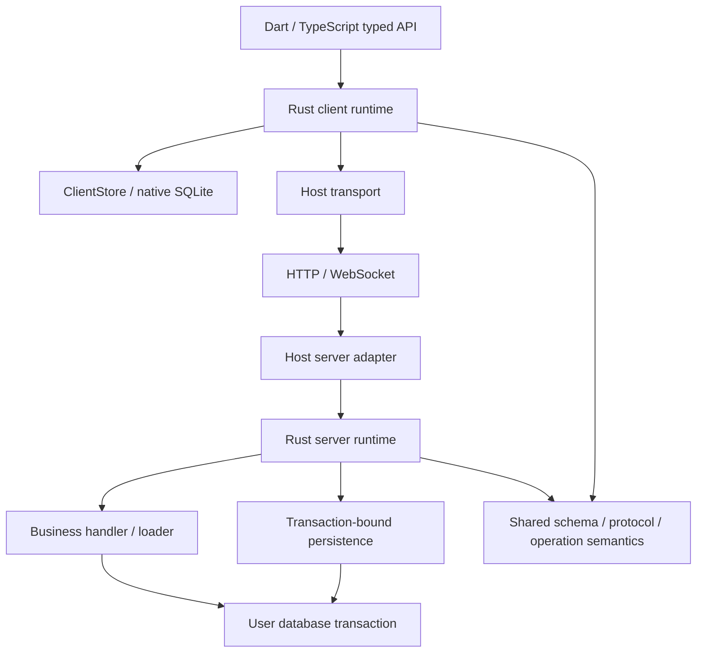

# local-first-state: Rust Core Architecture Proposal

[English](2026-09-10-rust-core-design.md) | [简体中文](../../zh-CN/superpowers/specs/2026-09-10-rust-core-design.md)

> Historical design record (2026-09-10): status statements and proposed APIs below reflect the original planning stage. See [implementation evidence](../../implementation-progress.md) for the current delivered scope and verified limitations.

Date: 2026-09-10. Status: architecture boundaries have been discussed; the runtime has not been implemented. Latest scope: first preserve the existing logic in Rust; record revision and other semantic extensions have moved to [Next things](../../next-things.md). The APIs in this document are proposed interfaces.

## 1. Recommendation

Build the Rust client runtime, server runtime, and their shared protocol/model/operation semantics from scratch. Dart/TypeScript SDKs retain natural business interfaces; the host supplies business handlers, loaders, authentication, networking, and database access within transactions.

Business authors are not required to switch to Rust. Rust unifies the framework algorithms, while business authors can still compose operations and call services in their own languages. Rust also need not become a standalone server program.

First build a real, complete round trip: Dart → Rust client → HTTP → Node SDK → Rust server → Prisma transaction. It must withstand rollback, restarts, and out-of-order ACK/pull arrival. Validate transaction correctness across languages before a complete compiler, Nest decorators, or support for multiple databases.

The [existing logic coverage table](2026-09-10-existing-logic-audit.md) is the feature preservation checklist. The [implementation plan](../plans/2026-09-10-rust-rebuild.md) provides task order and acceptance criteria.

## 2. Existing Agreement and New Proposals

### Existing agreement

- The project is named `local-first-state` and positioned as a local-first state framework.
- Build the new implementation from scratch, using the existing source as a reference; the private repository remains private.
- A channel is an explicit, dynamic, business-defined string; publish must carry channels.
- A handler performs business writes; a loader projects real backend data into client models; publish is a framework-provided method used within a transaction.
- Users manage transactions, and the framework joins the same transaction without forcing users to switch to a framework database connection.
- The backend embeds into existing programs; Nest decorators are optional developer conveniences, and the core cannot depend on Nest.
- ACK and the arrival of authoritative state are separate events; retain the necessary settlement barrier.
- Client and server framework protocol logic share Rust to reduce the burden of keeping independent language implementations aligned.

### Current implementation boundaries

- The Rust runtime reads generic schema data; generators for each language emit business types.
- Implementations of client SQLite, language bridges, and server persistence adapters can be replaced without changing existing state and protocol semantics.
- Preserve batch transactions, mutation savepoints, batch receipts, frozen retries, required checkpoints, and accepted-prefix settlement.
- Do not add record revision or expand guarantees of correctness for out-of-order arrivals across channels; migrate existing claims behavior according to the reference implementation.
- Do not upgrade the wire protocol or change integer encoding, deletion representation, or cursor failure policy by default.
- Node/Dart binding tools will still be selected through a spike. Follow [concepts and naming](../../architecture/concepts-and-naming.md); map new interfaces to old protocol fields at the boundary.
- Record defects discovered in old behavior and propose separate fixes first; do not automatically change them during the rewrite. See Next things for subsequent extensions.

## 3. Three Possible Approaches

| Approach | Benefit | Cost | Assessment |
|---|---|---|---|
| Rewrite only the Rust client, retaining TS server algorithms | Fastest route to native client reuse | Protocol rules still have implementations in two languages | Suitable as a migration stage, not the final boundary |
| Rust client + server runtime with a shared protocol and host-provided I/O | Centralized rules; business authors keep their existing languages and transactions | Requires careful design of asynchronous bridging, packaging, and lifecycles | Recommended |
| Rust takes over the entire service, database, and all business handlers | Internals implemented in one language | User business logic must be rewritten or accessed through remote calls; difficult to join user transactions | Does not fit current goals |

Prisma's experience supports reducing large volumes of per-row data round trips across languages; it does not imply that all logic should remain in TypeScript. Our goal of reusing Dart/JS client algorithms is different, but actual bridging costs still need to be measured.

## 4. Modules and Responsibilities

Organize modules by responsibility in a Cargo workspace; split crates only when different targets or dependencies require it:

- `lfs-core`: schema descriptions, identity, value types, operation validation, protocol types/codecs, and error classification. No SQL, sockets, Node, or Dart.
- `lfs-client`: projection, queue, readiness, channel state, pull, settlement, and query plans; accesses storage through ClientStore.
- `lfs-server`: deduplication, handler dispatch, publish, loading, and page/receipt construction; requests I/O through host ports.
- `lfs-sqlite`: native client persistence, local transactions, read-only queries, and change notifications after commit.
- `lfs-node` / `lfs-dart`: bindings and error/handle conversion, without duplicating state machines.
- `lfs-compiler`: later migrate existing compiler semantics and generators, emitting Rust descriptors + Dart/TS facades.
- Keep TypeScript `server`, `prisma`, and `nest` packages separate; the HTTP adapter handles requests/responses, and the Nest adapter handles DI discovery.

Initially, a Node test endpoint driven by a native Rust client is sufficient to validate JS bindings; a complete browser TS client is a separate later deliverable.

## 5. The Boundary Between Rust and the Host

Framework handlers (validation, deduplication, settlement) live in Rust. Business handlers (updating Entry, permissions, domain service calls) remain in the host. Client business callbacks construct structured operations; replay does not rerun arbitrary user Dart/JS callbacks.

### Server host ports

The logical interfaces are `ServerPersistence`, `MutationDispatcher`, `LoaderDispatcher`, and `WakeSource`. Rust asynchronously awaits host results; the Node bridge only forwards commands and results and does not decide ACKs, versions, or cursors.

Pass the following across languages:

- A named mutation and its input in one call, rather than a callback for each field.
- A load request/result grouped by model in one call, rather than callbacks per record.
- Persistence operations with atomic semantics, rather than exposing arbitrary host objects to Rust.
- Rust-owned session/call IDs and owned bytes/values; do not retain raw JS/Dart object pointers across FFI.

The first implementation uses concrete asynchronous host commands and typed replies, without building a programmable general-purpose effect VM. If nested NAPI callbacks are difficult to implement safely, expose the same Rust state machine through suspend/resume; changing the bridge does not change ownership of protocol algorithms.

### Lifecycle requirements

- Each transaction session binds to exactly one real transaction and becomes invalid immediately when the transaction ends or rolls back.
- All framework DB work must have been awaited before the `withTransaction` promise completes; fire-and-forget writes are prohibited.
- Within a transaction, do not run operations that depend on database results in parallel; do not block the JS event loop while awaiting a JS Promise.
- Rust panics, host exceptions, and cancellation produce only typed failures; unwinding must not cross FFI.
- After a connection closes, logout, or Rust runtime disposal, old callbacks may only finish or be discarded; they must not write into a new session.
- Request cancellation does not prove DB rollback: if the commit outcome is uncertain, the client queries/retries the receipt using the same frozen batch.

### Client storage boundary

On native platforms, Rust owns the SQLite connection by default and executes work on a dedicated worker/actor to avoid synchronous DB I/O on the UI thread. Dart transaction callbacks use handles for read-your-writes; do not expand the entire callback in advance into a static list that cannot express dependent reads.

A single local transaction allows direct local work, named mutation savepoints, and channel changes. Notify watchers together after commit; rollback does not expose intermediate visible states through notifications. If external application SQLite writes need to share the transaction, provide a controlled adapter/session later; two drivers opening their own connections cannot be claimed to share a transaction.

## 6. Three Business Primitives and Existing Behavior

Handlers execute user business logic; loaders read complete frontend state for a viewer/channel; publish explicitly specifies channels and writes invalidations within the user transaction. Plain function registration and optional Nest decorators invoke the same Rust runtime.

The user supplies a transaction runner that opens an outer transaction for a batch dispatch, with all handlers using the same tx. The framework performs claims, mutation savepoints, publications, and receipts inside it; it does not open another DB connection on the user's behalf.

The default interface cannot independently begin/commit each handler while claiming to preserve rollback of the entire batch. The proposal for independent handler-level transactions has moved to later discussion. The application's own non-push writes can still call publish within transactions it opens itself.

The SDK may improve how loader results are organized, but internally they must adapt to the original identity alignment and visibility semantics; the current meaning of null is not extended into a new global tombstone in this round. Existing prepareForViewer behavior and transaction requirements must also migrate; do not change it into a pure read by default.

Nest provider registration is still necessary; detect missing or duplicate bindings at startup. Changing interfaces and naming does not remove existing validation.

## 7. Preserve Existing Batch Transactions and Receipts

- A batch is the unit of the outer server transaction and receipt; validate owner/client/sequence/semantic hash.
- Retries with the same sequence and content return the existing receipt; handle conflicts, gaps, and overlaps according to the old contract.
- Execute each mutation in a savepoint; an explicit business rejection rolls back the current mutation and records the rejection, while other mutations may continue.
- An unknown handler exception or failure to persist receipts/publications rolls back the entire batch, including earlier mutations that succeeded but have not yet committed.
- Commit the batch's business writes, invalidations, checkpoints, and receipt together. Do not send an accepted ACK before the outer user transaction completes.
- The client continues retrying frozen requests; queue behavior for accepted but unsettled entries and unsent entries retains existing rules.

This is the current baseline; independent per-mutation transactions, receipts, and partial commits are outside this rewrite.

## 8. Publish and Persistence

`publish` retains explicit channels. Persistence is not message delivery: do not publish authoritative results over the network before database commit.

Required semantic capabilities include:

| Port capability | Atomicity/isolation guarantee |
|---|---|
| claim batch / load receipt | Mutual exclusion on the same key; owner and hash validation; locks held until the transaction ends |
| savepoint / rollback / release | A business rejection can roll back its writes before writing the receipt |
| reserve channel positions | Monotonically increasing per channel; bounded range; rolled back with the transaction |
| upsert invalidations | In the same real transaction as head/business writes |
| read snapshot | Read contracts for head, scan, membership, and content |
| save receipt | Atomic commit with business writes/publication |

The first official implementation targets PostgreSQL + Prisma (check the project's current Prisma 6 API; upgrading to 7 is not a prerequisite). Provide pg/SQLx adapters later rather than implementing all databases at once.

A generic executor can reduce repetitive ORM wrappers, but a CRUD facade cannot express all the guarantees above. unadapter's current Prisma adapter can wrap tx for CRUD, but has no unified lock/increment/raw SQL interface, and its transaction fallback does not start a real transaction. Its mappings can inform or be reused in our implementation, but its capability gaps must not weaken our guarantees.

In the first version, the session persists immediately when publish is called to guarantee read-your-writes inside the callback. Multiple publish calls in one transaction may initially use explicit semantics of multiple increments; add tests before optimizing them into a merged operation. After an error, mark the transaction session as unable to continue so users cannot catch a persistence error and then commit business writes without their publication.

Channel row locks briefly serialize publications within the same channel; there is no framework-wide global lock across different channels. Additional locking for record revision belongs to a later proposal. Zero waiting cannot be promised. Operations involving multiple records/channels need a defined lock order or batch reservation; user domain locks may also cause deadlocks, and the entire transaction may be retried after database detection. Sorting channels within a single call cannot eliminate all deadlocks across multiple publish calls.

For wake, first migrate commit notification and catch-up behavior from the reference implementation. Notification gaps in external user transactions must be validated and recorded; PostgreSQL NOTIFY, additional polling, and multiprocess notification extensions require separate review rather than default behavior changes through renaming or rewriting.

## 9. The Boundary Between Channels and New Logic

This round retains existing channel head/cursor, compacted invalidation, and channel row claims, without introducing recordRevision or new deletion instructions. Current implementation limitations when the same record appears in multiple channels remain; using Rust does not automatically solve them.

The complete draft for new version comparisons, out-of-order Move handling, remove/delete distinctions, and tombstone GC has moved to [Next things](../../next-things.md) for review after the implementation preserving existing behavior is complete. The current conceptual name is standardized as Channel; identity and distribution scope remain independent dimensions.

## 10. Preserve ACK and Optimistic Settlement

ACK accepted confirms only business processing; remove the corresponding optimism only after required channel checkpoints arrive. Cursors from different channels cannot be compared. When ACK arrives after pull, decide immediately from the durable cursor without waiting for another page.

Preserve batch-level checkpoints, accepted-prefix rules, companion base advancement, and pending replay order; do not switch to per-mutation cleanup by default. The before-image remains the advancing authoritative base state for a dirty row; main is the result visible to the UI.

First migrate existing per-change apply, failure classification, and cursor skip behavior according to reference tests. Its risks are already in Next things; migration does not certify that behavior as correct. If a blocking issue is found during implementation, report it separately and review the fix.

## 11. Unify Protocol and Schema

Rust unifies the existing protocol codecs, identity specification, scalars, operation validation, and mutation history. Validate wire fields, representable integer ranges, null/absent handling, and unknown field/version handling against the reference implementation and existing vectors.

Do not expand the wire numeric range merely because Rust supports int64 internally, or introduce additional changes such as protocol-v2, epochs, or decimal strings in this round. The binding ABI may have its own versions and type conversions, but that does not constitute a network protocol upgrade.

Start the first round trip with a small set of schema types and one named mutation; cover all existing scalars/lists/enums/composite identities/relations/slots/history before full replacement. Add new models through schema metadata and language-generated code without recompiling the Rust binary.

## 12. How Testing Shrinks Without Disappearing

A single Rust core eliminates algorithm alignment tests for duplicate Dart/TS implementations; four distinct responsibilities remain:

1. Rust state machine/property tests: random ACK/page/retry/restart sequences; small, independent oracles verify invariants, so a client and server sharing the same mistake cannot count as a pass.
2. Persistence contracts: real SQLite/Postgres, rollback, lock contention, duplicate claims, snapshots, and unknown commit outcomes.
3. ABI tests: Dart/Node strings, bytes, integers, null, errors, cancellation, and handle lifecycles.
4. E2E: real SDKs, networking, business callbacks, and databases, ultimately reading client SQLite; retain golden wire vectors across versions.

Use the existing five conformance groups as an input checklist rather than copying their directories unchanged. Record old behavior such as `_commitSkip`, ambiguous null deletion, and batch transactions as it exists; change proposals go into Next things, and this round does not introduce intentional differences by default.

## 13. Migration and Release Boundaries

Deliver a new app example first, without switching Oasis. On 2026-09-10, the user explicitly requested a separate blank implementation branch: retain old source on main/in historical commits and delete it on `codex/rust-rebuild`. New code goes into `crates/`, `bindings/`, `packages/`, and `examples/rust-round-trip/`; do not copy the legacy implementation into the new working directory.

Do not discard mutations queued by old clients: Oasis migration must either drain the old queue whose outcomes can be determined before switching, or specifically implement queue/companion/local-only migration and an old wire bridge. Clearing the database cannot serve as a general upgrade strategy.

Discuss public release only after the complete coverage table is accepted, platform packaging works, and recovery and storage strategies are clear. Keep the current private GitHub visibility and do not publish to npm/pub.dev/crates. Add a license after the author selects one.

## 14. Questions the First Implementation Round Must Answer

- Can the Rust/JS bridge join a user-provided batch transaction while preserving savepoints, rollback, timeouts, and frozen receipt retries?
- Can Dart local transactions preserve read-your-writes, mutation savepoints, restart recovery, and notifications after commit?
- Can both Rust sides pass existing protocol vectors and tests with independently expected states?
- Can a new schema work with the same compiled binary, and are the language-generated types accurate?
- Does the persistence adapter satisfy existing transaction/read contracts?

Record revision, per-mutation transactions, cursor failure policy, and wire upgrades are not changes to bundle into the first round.

## 15. Sources Checked

- [Prisma architecture shift](https://www.prisma.io/blog/from-rust-to-typescript-a-new-chapter-for-prisma-orm): separation of query planning from TypeScript execution and the cost of data crossing languages.
- [NAPI-RS async](https://napi.rs/docs/concepts/async-fn), [ThreadsafeFunction](https://napi.rs/docs/concepts/threadsafe-function): asynchronous host callbacks and owned data requirements; this project has not yet completed bridge validation.
- [flutter_rust_bridge](https://cjycode.com/flutter_rust_bridge/): a candidate Dart/Rust tool, not a selected version or promise of complete compatibility.
- [rusqlite Transaction](https://docs.rs/rusqlite/latest/rusqlite/struct.Transaction.html): a candidate native SQLite implementation.
- [SQLx Transaction](https://docs.rs/sqlx/latest/sqlx/struct.Transaction.html), [SeaORM ConnectionTrait](https://docs.rs/sea-orm/latest/sea_orm/trait.ConnectionTrait.html): transaction integration for future Rust hosts.
- [River transactional enqueueing](https://riverqueue.com/docs/transactional-enqueueing): a precedent for writing framework records in the same business transaction.
- [unadapter source](https://github.com/productdevbook/unadapter/tree/84c3eea488d1c174d4178ae30d7ad55c7e96f0c1): the version inspected in this round; CRUD support does not imply a complete concurrency protocol.

## 16. Subsequent Confirmation: A Schema-Driven Generic Runtime

The user has confirmed the boundary between Rust and host languages and explicitly stated that the Rust runtime does not depend on generated business types. Each language's generator produces `Entry`, `Book`, and similar types; Rust receives validated schema descriptions and generic operations. Changing the application schema does not require recompiling the framework binary. The term Rust descriptor in compiler output refers only to generic descriptive data, not generated business Rust structs.

The user has authorized creating a blank implementation worktree/branch and deleting the old code on that branch. See [code organization](../../architecture/code-organization.md) for specific directories and dependency directions. The latest decision requires preserving existing behavior; extensions such as per-mutation receipts and record revision all belong in Next things.
