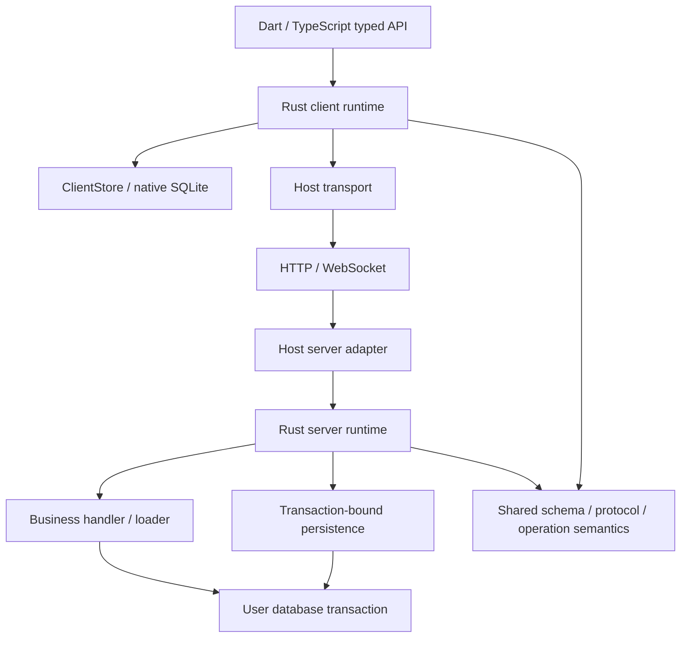

# local-first-state：Rust 核心架构提案

日期：2026-09-10。状态：架构边界已讨论，runtime 尚未实现。最新范围：先用 Rust 保留原有逻辑；record revision 和其他语义扩展移至 [Next things](../../next-things.md)。本文 API 为拟议接口。

## 1. 推荐结论

从零构建 Rust 的客户端 runtime、后端 runtime，以及二者共用的协议/模型/操作语义。Dart/TypeScript SDK 保留自然的业务接口，宿主提供业务 handler、loader、认证、网络和事务内数据库访问。

不要求业务作者改用 Rust。Rust 统一框架的算法，业务作者仍能在自己的语言中组合操作和调用服务。Rust 也不必成为独立 server 程序。

先做一个真实 Dart → Rust client → HTTP → Node SDK → Rust server → Prisma transaction 的完整闭环；它要能经受回滚、重启和 ACK/pull 乱序。跨语言事务正确性应先于完整 compiler、Nest 装饰器和多数据库支持验证。

[现有逻辑覆盖表](2026-09-10-existing-logic-audit.md) 是功能保留清单。[实施计划](../plans/2026-09-10-rust-rebuild.md) 给出任务次序和验收条件。

## 2. 已有共识与本次新增提议

### 已有共识

- 项目名 `local-first-state`；定位 local-first state framework。
- 新实现从零构建，已有源码作为参考，私有仓库保持私有。
- channel 是显式、动态、业务定义的字符串；publish 必须携带 channels。
- handler 是业务写入；loader 把真实后端数据投影成客户端 model；publish 是框架提供的事务内方法。
- 用户管理事务，框架加入同一事务，不强迫用户改用框架数据库连接。
- 后端嵌入现有程序；Nest 装饰器是可选 DX，核心不能依赖 Nest。
- ACK 与权威状态到达是两件事；保留必要的 settlement barrier。
- 前后端的框架协议逻辑共用 Rust，减少独立语言实现之间的对齐负担。

### 当前实施边界

- Rust runtime 读取通用 schema 数据；各语言 generator 输出业务类型。
- 客户端 SQLite、语言 bridge 和后端 persistence adapter 可以更换实现，不改变原有状态与协议语义。
- 保留 batch transaction、mutation savepoint、batch receipt、frozen retry、required checkpoints 和 accepted-prefix settlement。
- 不添加 record revision，不扩大跨 channel 乱序正确性承诺；现有 claims 行为按参考实现迁移。
- 不默认升级 wire 或改变整数编码、删除表示、cursor failure policy。
- Node/Dart binding 工具仍通过 spike 选择。命名以 [概念与命名](../../architecture/concepts-and-naming.md) 为准，新接口与旧协议字段在边界映射。
- 发现旧行为缺陷先记录并提出独立修复，不借重写自动改变。后续扩展见 Next things。

## 3. 三条可选路线

| 路线 | 收益 | 成本 | 判断 |
|---|---|---|---|
| 只重写 Rust client，保留 TS server 算法 | 最快得到原生客户端复用 | 仍有两种语言实现协议规则 | 可用作迁移阶段，不作为最终边界 |
| Rust client + server runtime，共享协议，宿主实现 I/O | 规则集中；业务作者继续使用现有语言和事务 | 需要小心设计异步桥接、打包、生命周期 | 推荐 |
| Rust 接管完整服务、数据库和所有业务 handler | 单语言内部实现 | 用户业务必须改写或通过远程调用，难以加入用户事务 | 不符合当前目标 |

Prisma 的经验支持减少大量逐行数据跨语言往返，不能由此推出所有逻辑应留在 TypeScript。我们要复用 Dart/JS 客户端算法，目标不同；但仍要测量实际桥接成本。

## 4. 模块与责任

推荐在 Cargo workspace 中按职责分模块，只有需要不同 target/dependency 时才拆 crate：

- `lfs-core`：schema 描述、identity、值类型、操作验证、协议类型/codec、错误分类。无 SQL、socket、Node、Dart。
- `lfs-client`：projection、queue、readiness、channel state、pull、settlement、query plan；通过 ClientStore 访问存储。
- `lfs-server`：去重、handler 调度、publish、loading、page/receipt 构造；通过 host ports 请求 I/O。
- `lfs-sqlite`：native 客户端持久化、本地事务、只读查询、提交后变更通知。
- `lfs-node` / `lfs-dart`：binding 和错误/handle 转换，不复制状态机。
- `lfs-compiler`：后期迁入现有 compiler 语义和生成器，输出 Rust descriptor + Dart/TS facade。
- TypeScript `server`、`prisma`、`nest` 包分开；HTTP adapter 负责 request/response，Nest adapter 负责 DI discovery。

最初用 native Rust client 驱动的 Node 测试端即可验证 JS binding；完整浏览器 TS client 在后期有独立交付。

## 5. Rust 与宿主的边界

框架 handler（校验、去重、结算）在 Rust。业务 handler（更新 Entry、权限、领域服务调用）仍在宿主。客户端业务 callback 构造结构化操作；replay 不重新运行用户的任意 Dart/JS callback。

### 后端 host ports

逻辑接口为 `ServerPersistence`、`MutationDispatcher`、`LoaderDispatcher`、`WakeSource`。Rust 异步等待 host 结果；Node bridge 只转发命令和结果，不决定 ACK、版本或 cursor。

跨语言传递：

- 一次具名 mutation 及其输入，而不是每个字段一个 callback。
- 一次按 model 分组的 load 请求/结果，而不是逐 record callback。
- 有原子语义的 persistence 操作，而不是暴露任意宿主对象给 Rust。
- Rust-owned session/call ID、owned bytes/value，不跨 FFI 保存裸 JS/Dart 对象指针。

第一次实现采用具体的异步 host commands 和 typed replies，不建设可编程的通用 effect VM。若 NAPI callback 嵌套难以安全实现，可以将同一 Rust state machine 暴露为 suspend/resume；改变 bridge 不改变协议算法归属。

### 生命周期要求

- 每个事务 session 只能绑定一个真实事务；事务结束或 rollback 后立即失效。
- `withTransaction` promise 未完成前，所有 framework DB work 都已 awaited；禁止 fire-and-forget 写入。
- 事务内部不并行执行依赖数据库结果的操作；不在等待 JS Promise 时阻塞 JS event loop。
- Rust panic/宿主异常/取消只产生 typed failure；不能跨 FFI unwind。
- 连接关闭、logout、Rust runtime dispose 后，旧回调只能结束/丢弃，不写入新的 session。
- 请求取消不证明 DB rollback：如果 commit 结果不确定，客户端按相同 frozen batch 查询/重试 receipt。

### 客户端存储边界

native 默认 Rust 拥有 SQLite connection，在专用 worker/actor 执行，避免 UI 线程同步 DB I/O。Dart transaction callback 使用 handle 进行 read-your-writes；不把整个 callback 预先展开成无法表达依赖读取的静态列表。

同一个本地 transaction 内允许直接本地工作、具名 mutation savepoint 和 channel 变更。commit 后统一通知 watcher；rollback 不通知可见中间状态。外部应用 SQLite 写入若需要同事务，应后续提供受控 adapter/session，不能同时让两个驱动各开 connection 后声称同事务。

## 6. 三个业务 primitive 与原行为

handler 执行用户业务；loader 在 viewer/channel 上读取完整前端状态；publish 显式指定 channels 并在用户事务内写 invalidation。普通函数注册与可选 Nest decorator 都调用相同 Rust runtime。

用户提供 transaction runner，在一次 batch 调度外层开启事务，所有 handler 使用同一 tx。框架在它内部执行 claim、mutation savepoint、publication 和 receipt；不会替用户另开 DB connection。

不能把每个 handler 独立 begin/commit 作为默认接口，同时又声称保留整个 batch 的 rollback。handler 级独立事务提议已经移至后续讨论。应用自己的非 push 写入仍可在自行开启的 transaction 内调用 publish。

loader 可以通过 SDK 改善结果组织方式，但内部必须适配成原来的 identity 对齐及可见性语义；当前 null 的含义不在本轮扩展成新的全局 tombstone。prepareForViewer 的已有行为和事务要求仍需迁移，不能默认改成纯读。

Nest provider 注册仍然必要；启动时发现缺少或重复 binding。改接口与命名不等于取消原有校验。

## 7. 保留现有 batch 事务与 receipt

- batch 是后端外层事务及 receipt 单位；校验 owner/client/sequence/semantic hash。
- 同 sequence、同内容的重试返回已有 receipt；冲突、gap、overlap 按旧契约处理。
- 每个 mutation 在 savepoint 中执行；明确业务拒绝回滚当前 mutation 并记录 rejection，其余 mutation 可继续。
- 未知 handler 异常或 receipt/publication 持久化失败回滚整个 batch，包括较早执行成功但尚未提交的 mutation。
- batch 的业务写入、invalidation、checkpoint 和 receipt 一起 commit。外层用户事务完成前不能发送 accepted ACK。
- 客户端继续重试被冻结的请求；已接受未结算和未发出的队列行为保持现有规则。

这是当前基线；per-mutation 独立事务、receipt 及部分提交不属于此次重写。

## 8. Publish 与 persistence

`publish` 保留显式 channels。持久化不等于发送消息：数据库 commit 之前不通过网络发布权威结果。

需要的语义能力包括：

| Port 能力 | 原子性/隔离保证 |
|---|---|
| claim batch / load receipt | 同 key 互斥；owner 与 hash 校验；锁保持到事务结束 |
| savepoint / rollback / release | business rejection 能回滚其 writes 后写 receipt |
| reserve channel positions | 每 channel 单调递增；有界范围；事务 rollback 一起回滚 |
| upsert invalidations | 与 head/业务写入在同一个真实事务 |
| read snapshot | head、scan、membership、内容的读取契约 |
| save receipt | 与业务/publication 原子提交 |

官方先实现 PostgreSQL + Prisma（检查项目当前 Prisma 6 API，不以升级到 7 为前置条件）；以后提供 pg/SQLx adapter，不同时做所有 DB。

通用 executor 可减少 ORM 包装重复，但 CRUD facade 不足以表达所有上述保证。unadapter 当前 Prisma adapter 可包装 tx 做 CRUD，却没有统一 lock/increment/raw SQL 接口，并且其 transaction fallback 不开启真正事务。可以借鉴/复用其映射，不能让它的能力缺口降级我们的保证。

第一版 session 在调用 publish 时立即持久化，保证 callback 内的 read-your-writes；同事务多次 publish 可先使用多次递增的明确语义，优化为合并前必须补充测试。错误后 transaction session 标记不可继续，防止用户 catch 了 persistence 错误却提交缺少 publication 的业务写入。

channel 行锁会短暂串行化同一 channel 内的发布；不同 channel 没有框架全局锁。record revision 的附加锁定属于后续方案。不能承诺零等待。多 record/channel 操作要规定锁顺序或批量 reservation；用户领域锁也可能形成死锁，数据库检测后允许重试整个事务。只排序单次 channels 并不能消除所有跨多次 publish 的死锁。

wake 先迁移参考实现的 commit 通知与 catch-up 行为。外部用户事务的通知缺口需验证并记录；PostgreSQL NOTIFY、额外 polling 和多进程通知扩展单独评审，不能借命名或重写默认改变行为。

## 9. Channel 与新增逻辑的界限

本轮保留现有 channel head/cursor、compacted invalidation 和 channel row claims，不引入 recordRevision 或新的删除指令。相同记录在多 channel 中出现时，当前实现的限制仍然存在；使用 Rust 不自动解决这个问题。

新增版本比较、Move 乱序处理、remove/delete 区分及 tombstone GC 的完整草案已移至 [Next things](../../next-things.md)，待保留原行为的实现完成后再评审。当前概念名称统一为 Channel；身份与分发范围仍是独立维度。

## 10. 保留 ACK 与 optimistic 结算

ACK accepted 仅确认业务处理；required channel checkpoints 到达后才移除相应 optimism。不同 channel 的 cursor 不能互相比较。ACK 晚于 pull 时从 durable cursor 立即判断，不等待额外 page。

保留按 batch 的 checkpoint、accepted-prefix 规则、companion base 推进和 pending replay 顺序，不默认改成 per-mutation 清理。before-image 继续作为 dirty row 的移动权威基础状态；main 是 UI 可见结果。

现有逐 change apply、失败分类及 cursor skip 行为先按参考测试迁移。它的风险已经进入 Next things，不能将迁移当成该行为的正确性认证；若实现中发现阻断问题，单独报告并评审修复。

## 11. 协议与 schema 的统一

Rust 统一现有协议 codec、identity 规范、scalar、operation 验证与 mutation history。wire 字段、整数可表示范围、null/absent 和未知字段/version 的处理按参考实现及现有 vectors 验证。

本轮不因 Rust 内部可用 int64 就擅自扩大 wire 数字范围，不引入 protocol-v2、epoch、decimal string 等额外变化。binding ABI 可以有自己的版本与类型转换，但不等于升级网络协议。

第一闭环从少量 schema 类型和一条具名 mutation 开始；完整替代前覆盖现有全部 scalar/list/enum/composite identity/relations/slots/history。新增 model 通过 schema metadata 和语言生成代码接入，不重编 Rust binary。

## 12. 测试如何减少而不是消失

一份 Rust core 消除 Dart/TS 重复实现的算法对齐测试；仍有四类不同责任：

1. Rust 状态机/属性测试：随机 ACK/page/retry/restart 序列；小而独立的 oracle 验证不变量，不能 client/server 互相同错就算通过。
2. persistence 契约：真实 SQLite/Postgres，rollback、锁竞争、重复 claim、snapshot、commit unknown。
3. ABI 测试：Dart/Node 字符串、bytes、整数、null、错误、取消、handle 生命周期。
4. E2E：真实 SDK、网络、业务 callback、DB，最终读客户端 SQLite；保留跨版本 golden wire vectors。

现有五组 conformance 作为输入清单，不原封不动移植目录。旧 `_commitSkip`、null 删除歧义和 batch 事务等按现有行为记录；改动提议进入 Next things，本轮不默认制造 intentional differences。

## 13. 迁移与发布边界

先交付新 app 示例，Oasis 不切换。用户于 2026-09-10 明确要求独立空白实现分支：旧源码在 main/历史提交保留，在 `codex/rust-rebuild` 删除。新代码进入 `crates/`、`bindings/`、`packages/`、`examples/rust-round-trip/`，不在新工作目录复制 legacy 实现。

旧客户端排队 mutation 不能丢弃：Oasis 迁移要么先排空可确定的旧队列再切换，要么专门实现队列/companion/local-only 迁移和旧 wire bridge。不能以清空数据库作为通用升级方案。

只有当完整覆盖表被验收、平台打包成立、恢复和存储策略明确后，才讨论公开发布。当前 private GitHub 不改可见性、不发 npm/pub.dev/crates。license 由作者选择后再添加。

## 14. 第一轮实现必须回答的问题

- Rust/JS 的 bridge 能否加入用户提供的 batch transaction，保持 savepoint、rollback、timeout 和 frozen receipt 重试？
- Dart local transaction 能否保持 read-your-writes、mutation savepoint、重启恢复和 commit 后通知？
- Rust 两端能否通过现有协议 vectors 与独立预期状态测试？
- 新 schema 能否在同一已编译 binary 上工作，语言生成类型是否准确？
- persistence adapter 是否满足现有事务/读取契约？

record revision、per-mutation transaction、cursor failure policy、wire 升级均不是第一轮要一并改掉的事项。

## 15. 核查来源

- [Prisma 架构转变](https://www.prisma.io/blog/from-rust-to-typescript-a-new-chapter-for-prisma-orm)：查询计划与 TypeScript 执行分离、跨语言数据成本。
- [NAPI-RS async](https://napi.rs/docs/concepts/async-fn)、[ThreadsafeFunction](https://napi.rs/docs/concepts/threadsafe-function)：异步宿主 callback 和 owned data 要求；本项目尚未完成 bridge 验证。
- [flutter_rust_bridge](https://cjycode.com/flutter_rust_bridge/)：Dart/Rust 候选工具；不是已选定版本或完整兼容承诺。
- [rusqlite Transaction](https://docs.rs/rusqlite/latest/rusqlite/struct.Transaction.html)：native SQLite 候选实现。
- [SQLx Transaction](https://docs.rs/sqlx/latest/sqlx/struct.Transaction.html)、[SeaORM ConnectionTrait](https://docs.rs/sea-orm/latest/sea_orm/trait.ConnectionTrait.html)：未来 Rust host 的事务接入。
- [River transactional enqueueing](https://riverqueue.com/docs/transactional-enqueueing)：同业务事务写框架记录的先例。
- [unadapter 源码](https://github.com/productdevbook/unadapter/tree/84c3eea488d1c174d4178ae30d7ad55c7e96f0c1)：本轮检查的版本；支持 CRUD 不等于提供完整并发协议。

## 16. 后续确认：schema 驱动的通用 runtime

用户已确认 Rust 与宿主语言边界，并明确 Rust runtime 不依赖业务生成类型。`Entry`、`Book` 等由各语言 generator 生成；Rust 接收经过验证的 schema 描述和通用操作。更换应用 schema 不要求重编框架 binary。compiler 输出的 Rust descriptor 一词仅指通用描述数据，不指生成业务 Rust struct。

用户已授权新建空白实现 worktree/branch 并删除该分支旧代码。具体目录与依赖方向见 [代码组织](../../architecture/code-organization.md)。最新决定要求保留原有行为；per-mutation receipt 和 record revision 等扩展均放入 Next things。
