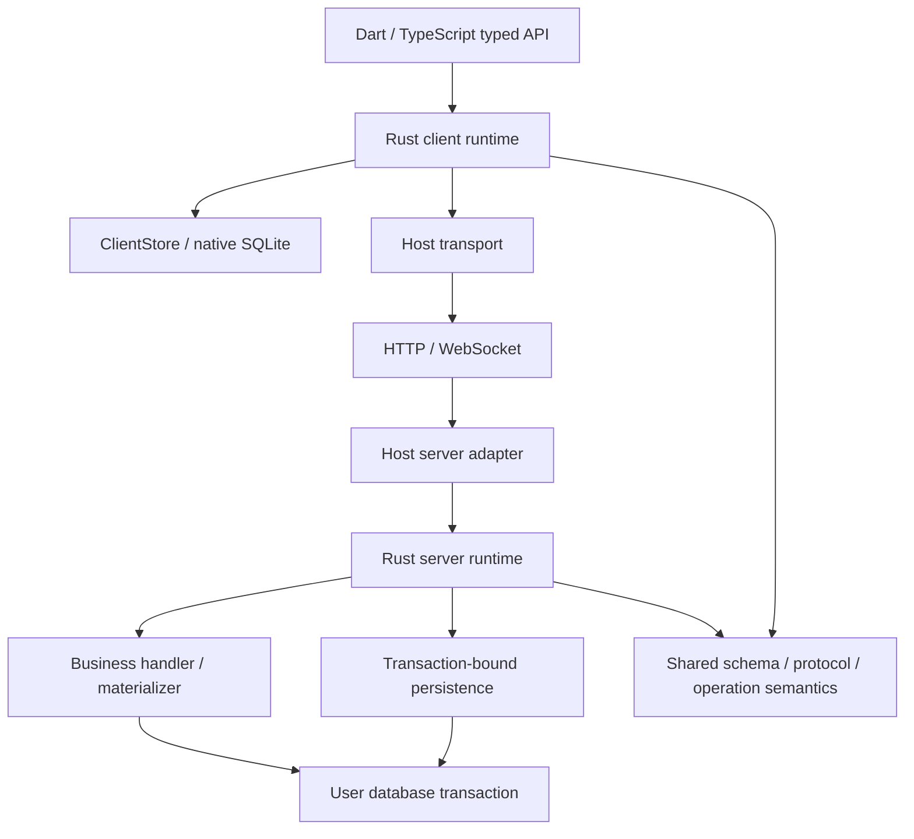

# local-first-state：Rust 核心架构提案

日期：2026-09-10。状态：供评审的设计与默认推荐，尚未实施。本文的 API 都是拟议接口，不是现有 API。

## 1. 推荐结论

从零构建 Rust 的客户端 runtime、后端 runtime，以及二者共用的协议/模型/操作语义。Dart/TypeScript SDK 保留自然的业务接口，宿主提供业务 handler、materializer、认证、网络和事务内数据库访问。

不要求业务作者改用 Rust。Rust 统一框架的算法，业务作者仍能在自己的语言中组合操作和调用服务。Rust 也不必成为独立 server 程序。

先做一个真实 Dart → Rust client → HTTP → Node SDK → Rust server → Prisma transaction 的完整闭环；它要能经受回滚、重启和 ACK/downlink 乱序。跨语言事务正确性应先于完整 compiler、Nest 装饰器和多数据库支持验证。

[现有逻辑覆盖表](2026-09-10-existing-logic-audit.md) 是功能保留清单。[实施计划](../plans/2026-09-10-rust-rebuild.md) 给出任务次序和验收条件。

## 2. 已有共识与本次新增提议

### 已有共识

- 项目名 `local-first-state`；定位 local-first state framework。
- 新实现从零构建，已有源码作为参考，私有仓库保持私有。
- scope 是显式、动态、业务定义的字符串；publish 必须携带 scopes。
- handler 是业务写入；materializer 把真实后端数据投影成客户端 model；publish 是框架提供的事务内方法。
- 用户管理事务，框架加入同一事务，不强迫用户改用框架数据库连接。
- 后端嵌入现有程序；Nest 装饰器是可选 DX，核心不能依赖 Nest。
- ACK 与权威状态到达是两件事；保留必要的 settlement barrier。
- 前后端的框架协议逻辑共用 Rust，减少独立语言实现之间的对齐负担。

### 本次推荐、需要评审的设计选择

1. 默认同步 record 均有 revision；暂不做“出现第二个 scope 时才开启版本”。
2. 将 wire 升级为显式新版本，不要求新 Rust runtime 直接打开旧 SQLite 文件或接受旧请求。
3. 为满足 handler 自己管理事务，推荐按 mutation 存 receipt；batch 只做运输分组。这是对现有 batch transaction 的明确改变。
4. native 客户端由 Rust 管理 SQLite；浏览器存储单独验证，不宣称 native adapter 自动兼容 Web。
5. Node 首先使用 NAPI-RS 做桥接；Dart 首先验证 flutter_rust_bridge。版本在第一个 spike 锁定，不预先承诺所有运行环境。
6. unadapter 是候选，可复用普通 CRUD，但目前不能作为原子 persistence 的唯一能力接口。

这些选择可以独立调整。本文没有将它们伪装成已经确定或已经实现的事实。

## 3. 三条可选路线

| 路线 | 收益 | 成本 | 判断 |
|---|---|---|---|
| 只重写 Rust client，保留 TS server 算法 | 最快得到原生客户端复用 | 仍有两种语言实现协议规则 | 可用作迁移阶段，不作为最终边界 |
| Rust client + server runtime，共享协议，宿主实现 I/O | 规则集中；业务作者继续使用现有语言和事务 | 需要小心设计异步桥接、打包、生命周期 | 推荐 |
| Rust 接管完整服务、数据库和所有业务 handler | 单语言内部实现 | 用户业务必须改写或通过远程调用，难以加入用户事务 | 不符合当前目标 |

Prisma 的经验支持减少大量逐行数据跨语言往返，不能由此推出所有逻辑应留在 TypeScript。我们要复用 Dart/JS 客户端算法，目标不同；但仍要测量实际桥接成本。

## 4. 模块与责任



推荐在 Cargo workspace 中按职责分模块，只有需要不同 target/dependency 时才拆 crate：

- `lfs-core`：schema 描述、identity、值类型、操作验证、协议类型/codec、错误分类。无 SQL、socket、Node、Dart。
- `lfs-client`：projection、queue、readiness、scope state、downlink、settlement、query plan；通过 ClientStore 访问存储。
- `lfs-server`：去重、handler 调度、publish、materialization、page/receipt 构造；通过 host ports 请求 I/O。
- `lfs-sqlite`：native 客户端持久化、本地事务、只读查询、提交后变更通知。
- `lfs-node` / `lfs-dart`：binding 和错误/handle 转换，不复制状态机。
- `lfs-compiler`：后期迁入现有 compiler 语义和生成器，输出 Rust descriptor + Dart/TS facade。
- TypeScript `server`、`prisma`、`nest` 包分开；HTTP adapter 负责 request/response，Nest adapter 负责 DI discovery。

最初用 native Rust client 驱动的 Node 测试端即可验证 JS binding；完整浏览器 TS client 在后期有独立交付。

## 5. Rust 与宿主的边界

框架 handler（校验、去重、结算）在 Rust。业务 handler（更新 Entry、权限、领域服务调用）仍在宿主。客户端业务 callback 构造结构化操作；replay 不重新运行用户的任意 Dart/JS callback。

### 后端 host ports

逻辑接口为 `ServerPersistence`、`MutationDispatcher`、`MaterializerDispatcher`、`WakeSource`。Rust 异步等待 host 结果；Node bridge 只转发命令和结果，不决定 ACK、版本或 cursor。

跨语言传递：

- 一次具名 mutation 及其输入，而不是每个字段一个 callback。
- 一次按 model 分组的 materialize 请求/结果，而不是逐 record callback。
- 有原子语义的 persistence 操作，而不是暴露任意宿主对象给 Rust。
- Rust-owned session/call ID、owned bytes/value，不跨 FFI 保存裸 JS/Dart 对象指针。

第一次实现采用具体的异步 host commands 和 typed replies，不建设可编程的通用 effect VM。若 NAPI callback 嵌套难以安全实现，可以将同一 Rust state machine 暴露为 suspend/resume；改变 bridge 不改变协议算法归属。

### 生命周期要求

- 每个事务 session 只能绑定一个真实事务；事务结束或 rollback 后立即失效。
- `withTransaction` promise 未完成前，所有 framework DB work 都已 awaited；禁止 fire-and-forget 写入。
- 事务内部不并行执行依赖数据库结果的操作；不在等待 JS Promise 时阻塞 JS event loop。
- Rust panic/宿主异常/取消只产生 typed failure；不能跨 FFI unwind。
- 连接关闭、logout、Rust runtime dispose 后，旧回调只能结束/丢弃，不写入新的 session。
- 请求取消不证明 DB rollback：如果 commit 结果不确定，客户端按相同 mutation ID 查询/重试 receipt。

### 客户端存储边界

native 默认 Rust 拥有 SQLite connection，在专用 worker/actor 执行，避免 UI 线程同步 DB I/O。Dart transaction callback 使用 handle 进行 read-your-writes；不把整个 callback 预先展开成无法表达依赖读取的静态列表。

同一个本地 transaction 内允许直接本地工作、具名 mutation savepoint 和 scope 变更。commit 后统一通知 watcher；rollback 不通知可见中间状态。外部应用 SQLite 写入若需要同事务，应后续提供受控 adapter/session，不能同时让两个驱动各开 connection 后声称同事务。

## 6. 三个业务 primitive 的拟议体验

先让普通函数注册可用，最后再加装饰器。以下为设计示例，省略 import 和应用 Repository 实现。

```ts
@Materializes(Entry)
class EntryMaterializer {
  constructor(private readonly entries: EntryRepository) {}

  async materialize(ctx: MaterializeContext, identities: EntryIdentity[]) {
    return this.entries.readVisible(ctx.tx, {
      viewer: ctx.viewer,
      scope: ctx.scope,
      identities,
    });
  }
}
```

materializer 返回按 identity 可匹配的完整 rows；框架根据请求匹配并验证 duplicate/extra。省略的 identity 表示当前 viewer 在这个 scope 不可见，由框架形成明确的 scope removal；不表示实体全局删除。读取失败必须抛错，不能返回空集合当作失败兜底。真实 delete 来自 explicit publication tombstone。

内部 runtime 为每个 upsert 附加一致性读取的 record revision。若 materializer 使用框架无法纳入 snapshot 的外部数据，必须提供 versioned snapshot 实现；第一个官方 adapter 只支持同 DB snapshot。用户更改可见性或 projection 依赖后仍需 publish；框架不能推断遗漏的投影依赖。

```ts
@Handles(UpdateEntry.v1)
class UpdateEntryHandler {
  constructor(private readonly prisma: PrismaClient) {}

  async handle(ctx: MutationContext, input: UpdateEntryInput) {
    return this.prisma.$transaction(tx =>
      ctx.withTransaction(prismaPersistence.bind(tx), async ({ publish }) => {
        const entry = await tx.entry.update({
          where: { id: input.entryId },
          data: { text: input.text },
        });

        await publish({
          scopes: [bookScope(entry.bookId)],
          model: Entry,
          identity: { id: entry.id },
        });
      }),
    );
  }
}
```

`withTransaction` 不 begin/commit：它在用户事务中先 claim/检查 receipt，再执行 callback、生成 publication checkpoint、写 receipt。scope 到达前仍保留 wire optimism。handler 必须返回 SDK 的 branded completion；不能漏调 `withTransaction` 却返回任意对象被视为 accepted。

框架等待 handler 外层 transaction promise 成功后，才释放 ACK 和 commit hints。该保证依赖用户 transaction runner 的实际 commit 语义；commit unknown 保持未知结果。外部付费/API 调用不受 DB rollback 覆盖，应使用业务自己的 outbox/idempotency。

后台非 uplink 写入也可以：用户事务内调用 `publisher.publish(persistence.bind(tx), change)`。它返回待 commit 的 wake hints；应用在 commit 后 notify，漏通知由 durable polling 补偿。

注册仍需要 Nest providers；DiscoveryService 去掉额外的 model→handler 大映射表，不是任意 class 自动执行。启动时检测 duplicate、缺少历史 version handler、缺少 materializer。

## 7. 最重要的事务取舍：mutation 与 batch

当前：batch 一个事务 + mutation savepoints。若用户在每个 handler 内自行 begin/commit，就不可能同时保留这个 batch 的整体 rollback。

这不是 Rust 强制带来的变化，而是事务所有权和原子单元的 API 选择；即使全部用 TypeScript，也需要作出同样选择。

推荐新协议：**mutation 是业务原子性、receipt 和 settlement 单位；batch 只是网络分组。** 第一闭环一次只发一条，完整调度阶段再组合网络 batch。

- mutation identity：`(authenticatedOwner, clientId, mutationOrdinal)`，ordinal 本地事务分配；同 key 重试必须相同 semantic hash。
- owner/client claim 和 receipt claim 在用户事务中锁定；并发重复请求只有一个进入业务 callback。
- accepted：业务修改、所有 publication、checkpoint witnesses、receipt 一起 commit。
- rejected：claim 后开业务 savepoint；明确业务拒绝 rollback 业务/publication，再持久化 rejection receipt。unknown failure rollback 整个 mutation transaction。
- handler 自己调用的 wrapper 必须提供 savepoint 能力；未支持该能力的 adapter 无法宣称支持完整 handler 契约。
- 相邻两条 mutation 中，第一条已经 commit，第二条异常，不撤销第一条；重试从各自 receipt 恢复。这一点必须在示例和迁移文档写明。
- 生命周期依赖只有前置 accepted 才可 dispatch；纯业务顺序依赖只要求已解决的先后，不自动传播 rejection。依赖是否允许同 transport batch 由 Rust 排序和结果决定。
- receipt alpha 阶段不按时间任意删除；压缩到水位需要专门的客户端确认协议，防止旧重试重复执行。

如果评审决定保留旧 batch 原子性，替代方案是应用提供 batch transaction runner，再把同一个 tx 传给所有 handler。两种模式不在第一版同时实现，也不能在一个 API 中隐式切换。

## 8. Publish 与 persistence

`publish` 保留显式 scopes。持久化不等于发送消息：数据库 commit 之前不通过网络发布权威结果。

需要的语义能力包括：

| Port 能力 | 原子性/隔离保证 |
|---|---|
| claim mutation / load receipt | 同 key 互斥；owner 与 hash 校验；锁保持到事务结束 |
| savepoint / rollback / release | business rejection 能回滚其 writes 后写 receipt |
| advance record revision | 同 `(model,id)` 原子增长，无全局 counter |
| reserve scope positions | 每 scope 单调递增；有界范围；事务 rollback 一起回滚 |
| upsert invalidations | 与 head/revision/业务写入在同一个真实事务 |
| read snapshot | head、scan、membership、record revision、内容的一致性视图 |
| save receipt | 与业务/publication 原子提交 |

官方先实现 PostgreSQL + Prisma（检查项目当前 Prisma 6 API，不以升级到 7 为前置条件）；以后提供 pg/SQLx adapter，不同时做所有 DB。

通用 executor 可减少 ORM 包装重复，但 CRUD facade 不足以表达所有上述保证。unadapter 当前 Prisma adapter 可包装 tx 做 CRUD，却没有统一 lock/increment/raw SQL 接口，并且其 transaction fallback 不开启真正事务。可以借鉴/复用其映射，不能让它的能力缺口降级我们的保证。

第一版 session 在调用 publish 时立即持久化，保证 callback 内的 read-your-writes；同事务多次 publish 可先使用多次递增的明确语义，优化为合并前必须补充测试。错误后 transaction session 标记不可继续，防止用户 catch 了 persistence 错误却提交缺少 publication 的业务写入。

scope 行锁会短暂串行化同一 scope 内的发布；不同 scope 没有框架全局锁。record revision 会串行化同一 record 的更改。不能承诺零等待。多 record/scope 操作要规定锁顺序或批量 reservation；用户领域锁也可能形成死锁，数据库检测后允许重试整个事务。只排序单次 scopes 并不能消除所有跨多次 publish 的死锁。

wake 方案：事务内 PostgreSQL NOTIFY 或外层 commit 后 hint，加有界 polling。listener 先注册再 catch-up，重连从 durable cursor 恢复，多进程不依赖单进程内存事件。

## 9. Scope、record revision 与删除

### 两种数字，各管一件事

- `scopeCursor`：某个 scope 的交付进度，也用于 settlement witness。
- `recordRevision`：同一个 `(model, identity)` 的内容新旧；不能比较不同 record 的 revision。

推荐所有同步 record 从创建起带 revision，避免后来发现重叠时升级老消息的复杂性。不需要系统全局变量，也不是每张 model table 一个 counter。

同一 publish 调用向 A/B fanout，共用同一 record revision；A/B 各自分配 scope cursor。重复调用同一 record 的 publish 需要事务内合并或显式 reuse publication token，不能误称两个不同调用天然只加一次。

revision 的比较域还包含账号/服务实例的 authority namespace；同一客户端会话内同 key/revision 必须得到相同完整权威内容。不同 viewer 的内容若不同，不能在切换账号时共用未隔离的缓存。对同一 viewer 的不同 scope 不支持同 key/revision 的不同字段视图；需要拆 model/identity。

只因 audience 变化而再发布允许 bump revision（内容可相同）；保证是同 revision 不得代表冲突权威内容，反向不要求相同内容必须同 revision。

### Wire 三种动作

- `upsert(identity, recordRevision, fullState)`：可见权威状态。
- `removeFromScope(identity)`：当前 scope 不再提供它；按该 scope 的顺序改变 membership。
- `deleteRecord(identity, recordRevision)`：实体真实删除，覆盖所有旧版本；删除必须仍通知受影响的 scope。

`removeFromScope` 与 `deleteRecord` 是协议级明确区分，不能依靠 null 猜测。scope claim 仍有存在价值，不因新增 record revision 就可删掉。

### Client 应用规则

1. 先验证 scope epoch/from/through 和 page 顺序。
2. membership 按 scope 流进度处理；record 内容按跨 scope recordRevision 判断。旧内容被忽略并不意味着其有效 membership 事件可以一并丢弃。
3. 新 upsert 推进 authoritative base，重放 pending；同 revision 同内容幂等；同 revision 冲突内容为协议错误并停止推进。
4. 新 tombstone 阻止旧 upsert 复活；更旧 tombstone 同样不能覆盖新内容。
5. remove 只释放当前 claim；另有有效 claim 则保留。最后 claim 离开时，authority availability 变 absent，并按既定 replay 规则处理 pending，不能把 pending silently 丢掉。
6. scope removal 导致父记录离开，不得不加判断就清除孩子其他 scope 的有效 claim。实体 cascade 与 scope-membership cascade 分开测试。

### 最新 fetch 不解决乱序

snapshot S1 读取 rev10 后网络延迟；S2 读取 rev11 先到。客户端仍必须拒绝后来抵达的 rev10。invalidation 的旧 revision 不能与 materializer 读到的新内容拼接；snapshot 中 current revision 与 state 必须相符。

### 存储规模与 reset

客户端保留版本 watermark/tombstone，防止离线旧消息复活；alpha 不做 TTL 猜测 GC。提供行数/字节统计和显式账号级 reset。server 保留 compacted invalidations 和去重信息。达到规模门槛前，设计 scope generation + snapshot reset：先 fencing 旧 session，再重建 claims/cursors，不删除 pending/local-only 数据。只有可以证明旧消息不可再出现，才清理 watermark。此机制未完成前，不宣称缓存永久有界。

scope 允许订阅不代表记录一定可见。materializer 是内容授权边界；若 identity 本身敏感，运输层也须过滤未知 identity 的撤回通知。可选 scope guard 是优化/元数据保护，不是强制 business primitive。权限变化必须发布 withdrawal 或触发明确 resnapshot。

## 10. ACK 与 optimistic 结算

保留：业务 commit 确认和权威投影到达不同。默认 ACK 不带主状态，不能以 optimistic patch 推进 wire record 的权威 base。

每个 accepted mutation 保存 settlement witnesses：`[{scope, epoch, through}]`。不是把 publish 涉及的每个 scope 无差别塞入 ACK；sender 必须有可读、会实际同步的 witness，并覆盖它本地预测的权威记录。

第一闭环限定每个 mutation 一个 sender 已订阅的共享 scope，全部 wire 预测都在该 scope materialize。多 scope 阶段显式声明 sender settlement scopes，server 验证是本次 publication 的有效来源；每个预测 record 至少有一个 coverage witness。不能用无关 principal scope 的 head 作为 fallback。无 wire prediction 的 command 可以 receipt-only；本地 companion 依其 mutation fate 最终落地。

若 viewer 在 ACK 后失去 scope 权限，不能假称 checkpoint 已应用。进入可见性恢复流程：服务端确认 withdrawal/reset，客户端原子处理对应 authority availability，再结算相应 witness；无法证明完成则保持 blocked 并暴露原因。这个场景是多 scope 阶段的发布门槛。

客户端将 application、cursor 和能结算的 mutation 清理放在同一 SQLite transaction。page 失败不推进；ACK 已到/downlink 未到继续显示 optimism；downlink 先到也保留相关本地预测，直到 ACK 的 witness 已满足。

每 mutation 结算减少无关 scope 的队头阻塞，但同 record 的 pending 操作仍按本地顺序 replay。同一 row 或 cascade/companion fate 相关的早先层未结算时，不能任意删除后层；先采用保守的 touched-row dependency barrier，通过测试后才放宽。

## 11. 协议与 schema 的统一

- 新 wire 有明确 protocolVersion、schema compatibility、server/account/scope epoch。
- counter/ordinal/revision 范围统一非负 signed-64，JSON decimal string；首版不用新二进制协议同时增加变量。
- canonical semantic hash 由 Rust 实现；限定 canonical value domain，浮点非有限值拒绝；null/absent、时间格式、UUID 规范有固定 vectors。
- model identity 不随 schema 演进改变；旧 mutation input history 保留。未知 mutation version 是 compatibility failure，不作为业务 rejection 消除 optimism。
- 桥接 ABI 自有版本协商，wire 版本不等于 native ABI 版本。
- 第一闭环支持明确的少量类型和 UpdateEntry；后续必须覆盖现有 scalar/list/enum/composite keys/relations/slots/history 才能声称替代。
- 新 SDK 要求业务输入与 optimistic projection 的对应关系有确定描述；第一阶段保留现有 slot 模型作为底层 IR，不同时引入任意函数型 replay。业务形状 facade 可生成在上层。

## 12. 测试如何减少而不是消失

一份 Rust core 消除 Dart/TS 重复实现的算法对齐测试；仍有四类不同责任：

1. Rust 状态机/属性测试：随机 ACK/page/retry/restart 序列；小而独立的 oracle 验证不变量，不能 client/server 互相同错就算通过。
2. persistence 契约：真实 SQLite/Postgres，rollback、锁竞争、重复 claim、snapshot、commit unknown。
3. ABI 测试：Dart/Node 字符串、bytes、整数、null、错误、取消、handle 生命周期。
4. E2E：真实 SDK、网络、业务 callback、DB，最终读客户端 SQLite；保留跨版本 golden wire vectors。

现有五组 conformance 作为输入清单，不原封不动移植目录。旧 `_commitSkip`、null 删除歧义、batch rollback 变化明确列为 intentional differences。

## 13. 迁移与发布边界

先交付新 app 示例，Oasis 不切换。用户于 2026-09-10 明确要求独立空白实现分支：旧源码在 main/历史提交保留，在 `codex/rust-rebuild` 删除。新代码进入 `crates/`、`bindings/`、`packages/`、`examples/rust-round-trip/`，不在新工作目录复制 legacy 实现。

旧客户端排队 mutation 不能丢弃：Oasis 迁移要么先排空可确定的旧队列再切换，要么专门实现队列/companion/local-only 迁移和旧 wire bridge。不能以清空数据库作为通用升级方案。

只有当完整覆盖表被验收、平台打包成立、恢复和存储策略明确后，才讨论公开发布。当前 private GitHub 不改可见性、不发 npm/pub.dev/crates。license 由作者选择后再添加。

## 14. 第一轮实现必须回答的问题

- Rust → JS callback → 同 Prisma tx → Rust finish → ORM commit 的链路能否正确传播异常、rollback、timeout 和重试？
- Dart local transaction 能否做到 read-your-writes、mutation savepoint、进程重启恢复和 commit 后统一通知？
- 每 mutation receipt 是否比旧 batch transaction 更符合预期？用两个 mutation 中途失败的示例评审，不靠抽象描述。
- revision 是否每条都带？本提案默认带；若坚持可选，需要另写 promotion/fencing 协议。
- materializer 能否始终在一致性 snapshot 中读 projection+revision？外部数据源单独适配。
- 目标平台先为 Dart native + Node server；Web、其他 backend 语言作为后续能力，不默认承诺。

## 15. 核查来源

- [Prisma 架构转变](https://www.prisma.io/blog/from-rust-to-typescript-a-new-chapter-for-prisma-orm)：查询计划与 TypeScript 执行分离、跨语言数据成本。
- [NAPI-RS async](https://napi.rs/docs/concepts/async-fn)、[ThreadsafeFunction](https://napi.rs/docs/concepts/threadsafe-function)：异步宿主 callback 和 owned data 要求；本项目尚未完成 bridge 验证。
- [flutter_rust_bridge](https://cjycode.com/flutter_rust_bridge/)：Dart/Rust 候选工具；不是已选定版本或完整兼容承诺。
- [rusqlite Transaction](https://docs.rs/rusqlite/latest/rusqlite/struct.Transaction.html)：native SQLite 候选实现。
- [SQLx Transaction](https://docs.rs/sqlx/latest/sqlx/struct.Transaction.html)、[SeaORM ConnectionTrait](https://docs.rs/sea-orm/latest/sea_orm/trait.ConnectionTrait.html)：未来 Rust host 的事务接入。
- [River transactional enqueueing](https://riverqueue.com/docs/transactional-enqueueing)：同业务事务写框架记录的先例。
- [unadapter 源码](https://github.com/productdevbook/unadapter/tree/84c3eea488d1c174d4178ae30d7ad55c7e96f0c1)：本轮检查的版本；支持 CRUD 不等于提供完整并发协议。

## 16. 后续确认：schema 驱动的通用 runtime

用户已确认 Rust 与宿主语言边界，并明确 Rust runtime 不依赖业务生成类型。`Entry`、`Book` 等由各语言 generator 生成；Rust 接收经过验证的 schema 描述和通用操作。更换应用 schema 不要求重编框架 binary。compiler 输出的 Rust descriptor 一词仅指通用描述数据，不指生成业务 Rust struct。

用户已授权新建空白实现 worktree/branch 并删除该分支旧代码。具体目录与依赖方向见 [代码组织](../../architecture/code-organization.md)。此前 per-mutation receipt 等被标为待评审的协议选择，尚未因此自动定稿。
